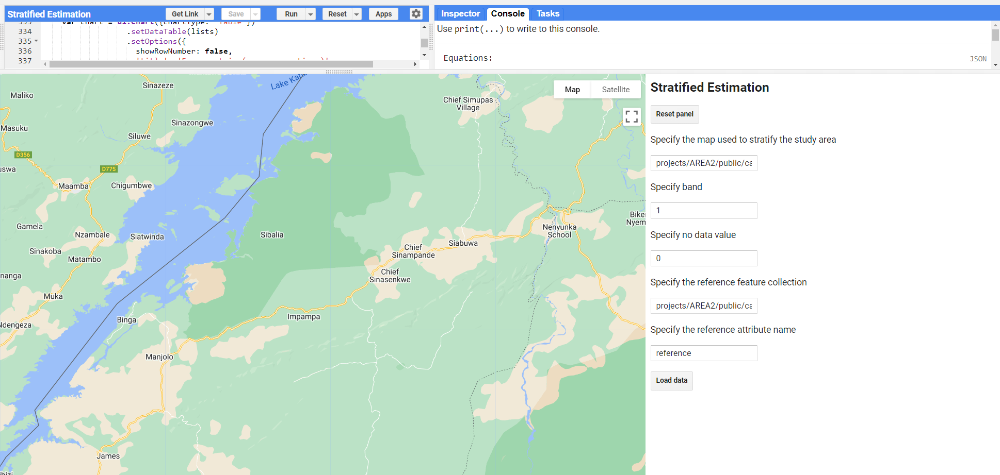
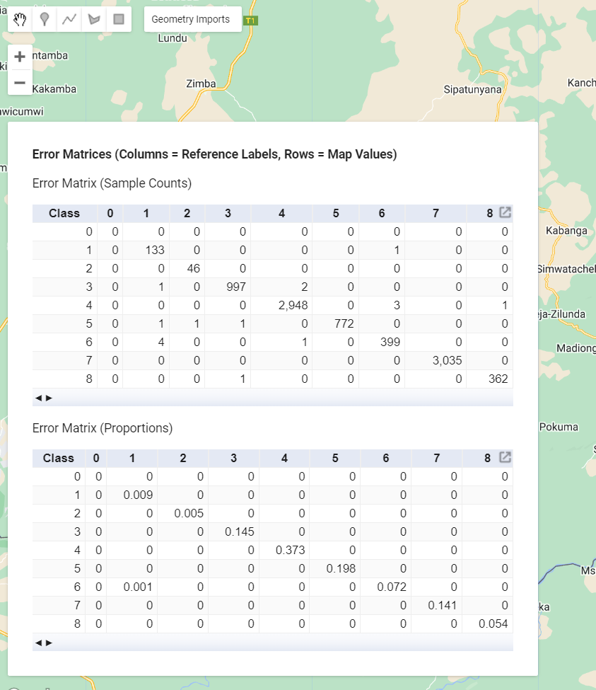

# Running KAZA Regional Land Cover Monitoring System
# Setup Instructions
## Python Environment Setup
### 1. Install Anaconda 
* Go to the Anaconda distribution [page](https://www.anaconda.com/products/distribution), scroll to the bottom and find the Anaconda installer file for your Operating System. 
* Run the installer .exe and follow all recommendations in the installer. This [installation docs page](https://docs.anaconda.com/anaconda/install/) provides step-by-step guidance depending on your OS and use-case.
* When Anaconda asks you "Do you wish the installer to initialize Anaconda3?" Say Yes
### 2. Test your Anaconda Installation
* Open your command-prompt/shell/terminal and type `conda list`. You should see something like this.


* notice we're in the `base` environment by default, as indicated by the command-line. We want to operate from a custom python environment.
### 3. Create a custom virtual environment
Keep your shell open and paste each one of these commands.
* Create a new conda env named 'gee'
```
conda create -n gee 
```
* Activate your new 'gee' env
```
conda activate gee
```
* In your shell, run this code block:
```
conda install -c conda-forge earthengine-api scikit-learn pandas
```
* Wait for package solver to finish and type y to proceed with installation.

## Git Setup
### 1. Download the Git installer for your OS from the Git downloads [page](https://git-scm.com/downloads). Run the installer following all recommended settings
### 2. Once installation is complete, open your command prompt/shell/terminal and type 
```
git --version
```


### 3. Clone the kaza repository to a local folder 

```
git clone https://github.com/kyle-woodward/kaza-lc.git
```


### 4. `cd` into your new kaza-lc folder and `ls`(linux/MacOS) or `dir`(Windows) to see its contents


## Earth Engine Setup
### Earth Engine requires you to authenticate your account credentials to access the Earth Engine API and your chosen Cloud Project. We do this with the `gcloud` python utility
### 1. Download the installer for the `glcoud` command-line python [utility](https://cloud.google.com/sdk/docs/install) from Google
### 2. Run the installer
### 3. Select Single User and use the default Destination Folder
### 4. Leave the Selected Components to Install as-is and click Install
### 5. Leave all four boxes checked, and click Finish. This will open a new command-prompt window and auto run gcloud initialization
### 6. It asks whether yo'd like to log in, type y - this will open a new browser window to a Google Authentication page


### 7. Choose your Google account that is linked to your Earth Engine account, then click Allow on the next page.


### 8. You will be redirected to a page that says "You are now authenticated with the gcloud CLI!"
### 9. Go back to your shell that had been opened for you by gcloud. It asks you to choose a cloud project and lists all available cloud projects that your google account has access to. Look for `wwf-sig` and then type the number it is listed as to set your project. 


### 10. Back in your separate shell window, first ensure you are in your custom conda env (running `conda activate env-name`), then run:
```
earthengine authenticate
```
### 11. In the browser window that opens, select the Google account that is tied to your EE account, select the wwf-sig cloud project, then click Generate Token at the bottom of the page.
### 12. On the next page, select your Google account again, then click Allow on the next page.
### 13. Copy the authorization token it generates to your clipboard and back in your shell, paste it and hit Enter. 

# Testing Your Setup
### Test that earthengine is setup and authenticated by checking the folder contents within the `wwf-sig` cloud project. 
### * In your shell, run:
```
earthengine ls projects/wwf-sig/assets/kaza-lc
```


If you do not get an error and it returns a list of folders and assets similar to this then you are good to go! :tada:

# Project Workflow
### Execute these steps in order create a yearly land cover product for a given year and region in KAZA 
*(tool in parentheses)*

### 1. Generate stratified random reference samples for interpretation in Collect Earth Online (01sample_pts.py)
### 2. Generate input data stack from chosen sensor used by the model (02sentinel2_sr.py)
### 3. Create land cover primitives from Random Forest models (03RFprimitives.py)
### 4. Construct categorical land cover map from the land cover primitives (04generate_LC.py)
### 5. Conduct accuracy assessment and estimate area (AREA2 tool)

#### click this link to accept the kazaLC Javascript repo: https://code.earthengine.google.com/?accept_repo=users/kwoodward/kazaLC

#### click this link to gain access to the WWF_KAZA Google Drive folder: https://drive.google.com/drive/folders/1Qd3Xo9ISQjQV15xxwqfgE-Dr1JFJ49M4?usp=sharing

## About the python scripts
### * Each script will be run on the command-line. The user must provide values for each required command-line argument to control the analysis.
### * You can first run any script, only declaring the `-h` flag. This will bring up the help dialog with a usage example and a description of required command-line arguments. 
### * Before you run any scripts, ensure you've activated your anaconda environment with your required dependencies and have changed into the `kaza-lc` directory that contains the scripts.
### example:
```
conda activate gee
cd C:\kaza-lc
```
# Generate Reference Samples for Training and Accuracy Assessment
## Python Script: 01sample_pts.py 
### This script generates sample points to be used as training and testing for your given AOI. Currently you provide the year for which the points are to be used and it exports points for all AOIs as Earth Engine Feature Collection and as a CSV file to a Google Drive folder. 
### * Run the script with python, choosing values for its required arguments
### example:
```
python 01sample_pts.py -y 2022
```


# Generate Input Stack
## Python Script: 02sentinel2_sr.py
### This script creates a data stack of input covariates to feed into the land cover models. It executes this process for one AOI and year that the user specifies.
### * Run the script with python, choosing values for its required arguments
### Note: `-o/--output` argument is optional. You can provide your own asset path, otherwise the script will create a default standardized file path. 
### Note: specifying the `--dry_run` argument allows you to run checks wihout actually executing the workflow.
### example:
```
python 02sentinel2_sr.py -a Zambezi -y 2022
```


### * The script reports that it is exporting a new dataset to the Earth Engine project. You can monitor submitted Earth Engine tasks in the [code editor](https://code.earthengine.google.com/) and clicking on Tasks tab in top-right


### * Once the export task has completed, confirm that the new dataset exists. In the [code editor](https://code.earthengine.google.com/), go to Assets tab on top-left and navigate to the `wwf-sig` cloud project folder. Find the dataset at the path that was reported in the previous script.


# Train and Apply Random Forest Primitive Model for each Land Cover type
## Python Script: 03RFprimitives.py 
### This script trains probability Random Forest models for each land cover class in your typology and exports them one at a time into a land cover 'Primitives' collection. While doing so, it also reports out some model performance metrics saved to a new folder created in your *local* `kaza-lc` folder on your computer.
### * Run the script with python, choosing values for its required arguments
### Note: `-o/--output` argument is again optional. If it is not provided, a default output path will be chosen.
### Note: specifying the `--dry_run` argument allows you to run checks wihout actually executing the workflow.
### example:
```
python 03RFprimitives.py -i projects/wwf-sig/assets/kaza-lc/input_stacks/BingaTestPoly_stack_2020 -r projects/wwf-sig/assets/kaza-lc/sample_pts/BingaDummyReferenceData  -o projects/wwf-sig/assets/kaza-lc/output_landcover/Primitives_BingaTestPoly_2020
```


### * Once the script completes, check several things:
#### 1. Check that the exports have been submitted by looking at the Tasks tab in the [code editor](https://code.earthengine.google.com/)

#### 2. Go into your local `kaza-lc` folder on your computer, check that a new folder named at the reported location has been created. In the example above the folder was named `C:\kaza-lc\metrics_Primitives_BingaTestPoly_2020`.
#### 3. Investigate the metric files located within. 


There should be one oobError .txt file and one varImportance .csv file per land cover. The oobError .txt files contain the Out-of-Bag Error estimate for that land cover's Random Forest model. The varImportance .csv files report out the relative importance of each input feature (covariate) in the input data stack.

# Generate final Land Cover image from the RF Primitives Collection
## Python Script: 04generate_LC.py
### This script takes the RF primitives collection generated from the previous script and creates a single-band land cover image from them.
### * Run the script with python, choosing values for its required arguments
### Note: `-o/--output` argument is optional.
### example:
```
python 04generate_LC.py -i projects/wwf-sig/assets/kaza-lc/output_landcover/Primitives_BingaTestPoly_stack_2020 -o 
projects/wwf-sig/assets/kaza-lc/output_landcover/LandCover_BingaTestPoly_2020
```


### * Like you've done previously, check that the export task has been submitted in the [code editor](https://code.earthengine.google.com/), and when the task completes, check that the new output file exists in the Assets tab. 

# Inspecting Land Cover Outputs
### In addition to digging into the files in your metrics folders, you should also look at the output land cover image to gain insight into how the land cover models are performing
### * In the [code editor](https://code.earthengine.google.com/), in the Scripts tab top-left, find the code repository named 'users/kwoodward/inspectingLCOutputs' and open it. Edit it as necessary to display the land cover products you would like to look at and click Run.


You can zoom in, and change the transparency of layers in the Layers widget in the top-right of the Map window.

# Accuracy Assessment and Area Estimation using [AREA2](https://area2.readthedocs.io/en/latest/overview.html)
### Once you have a final Land Cover ee.Image in your Earth Engine folder, you are ready to assess its accuracy and estimate area per class from that image.
__click this link to add the AREA2 GEE script repository to your Reader repos: [https://code.earthengine.google.com/?accept_repo=projects/AREA2/public](https://code.earthengine.google.com/?accept_repo=projects/AREA2/public)__
### We will be using the `Stratified Estimator` script tool. 


### * Open the script and click `Run`. A User Interface will be generated.



### * In the first dialog box, we will provide the full GEE asset path to our Land Cover `ee.Image`.
### * We leave the second dialog box, 'Specify Band' as default 1
### * In the third dialog box, we must specify the no data value. It must be a number that is not being used in the 'LANDCOVER' typology. For example, if your LANDCOVER values are 1-8, a no data value 0 is appropriate.
### * In the fourth dialog box, we provide the full GEE asset path to our testing samples `ee.FeatureCollection`. In our workflow, this is generated in the 03RFprimitives.py by separating the input reference data into '_trainingPts' and '_testingPts'. You want to select the '_testingPts' `ee.FeatureCollection`
### * Click Load Data, then another button 'Apply stratified estimator' will appear. Click that as well. 
### * Points that were classified inaccurately are added to the map, and Accuracy and Area metrics are printed to the Console. 


You can save or take a screenshot of the printed Accuracy and Area metrics. You can also retrieve the confusion/error matrices themselves as total counts or proportions by clicking the 'Show matrices' button in the UI. 




